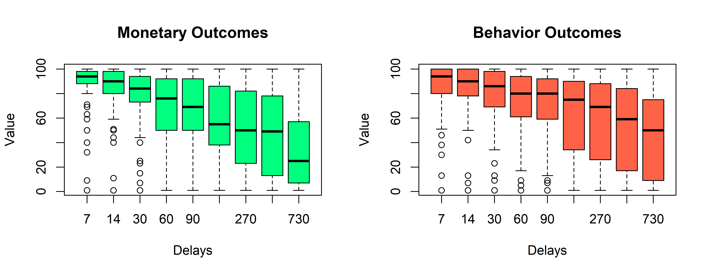
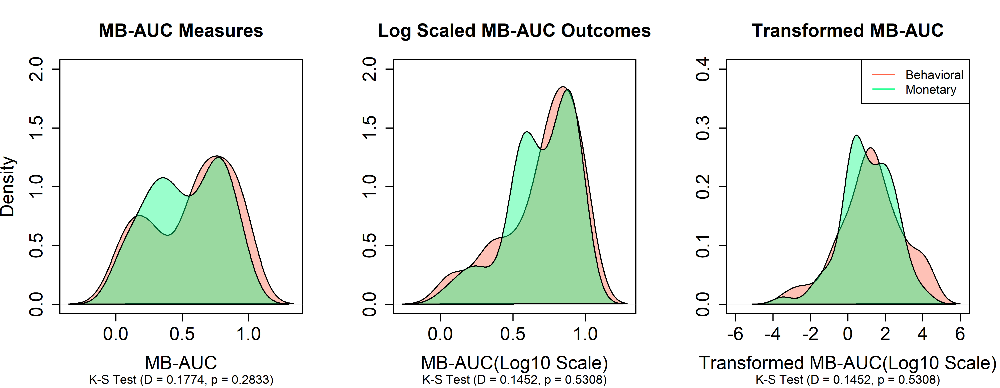
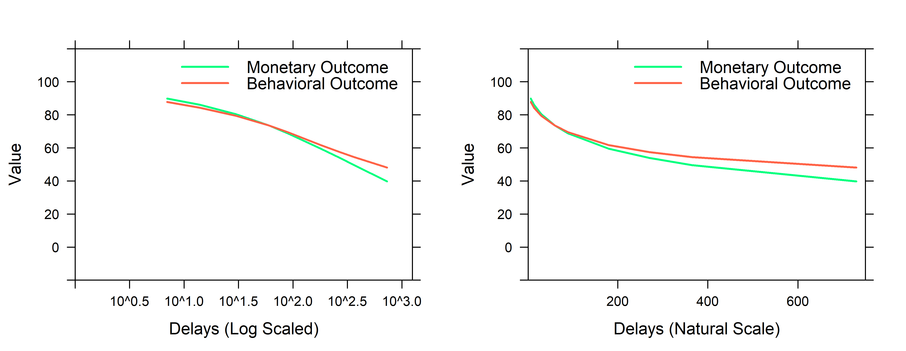
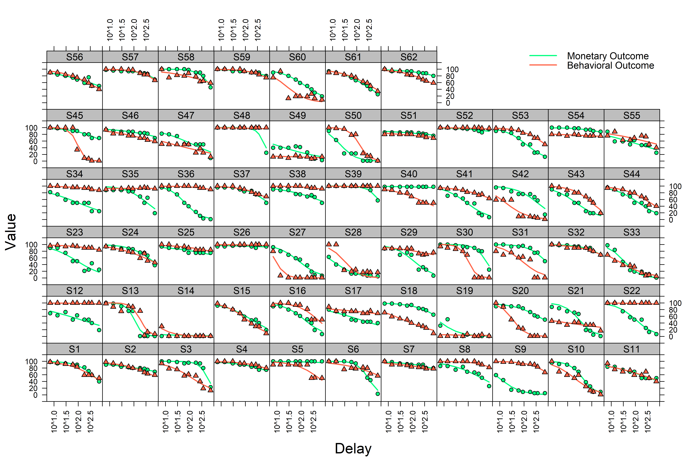
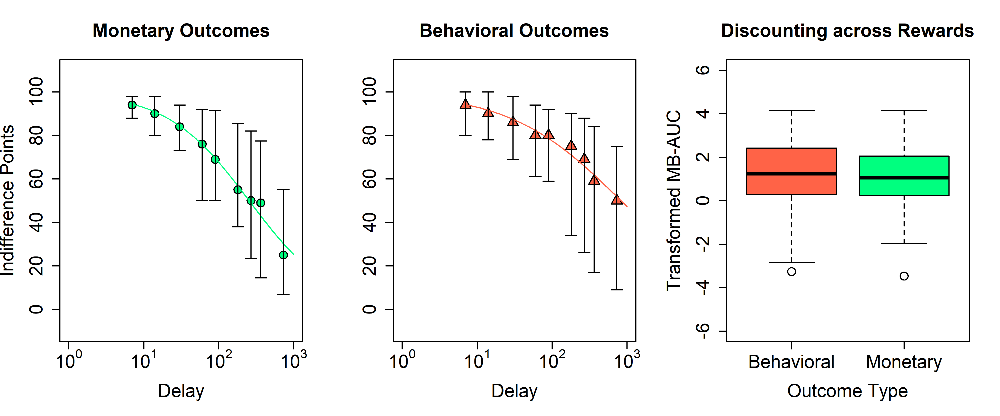

### Research Questions

RQ1: To what degree does the rate of discounting for behavioral outcomes differ from monetary outcomes at the individual-level?

RQ2: To what degree do other demographic variables (e.g., number of reported children, level of challenging behavior) correlate with the discounting of behavioral outcomes?

Sample Size: **61 parents**, per G*Power using results the results of logit-tranformed Log10-scaled AUC from Call, Reavis et al., (2015)

### Survey Data

From the **104** available parent responses, **62** parents met the Johnson & Bickel criteria for systematic responding in the monetary AND behavioral outcomes tasks (**59.62%** of all data).

### Indifference Point Data: Box Plots by Delay across Types

Responses below are a visualization of the data at each of the delays sampled. This is absent any model fitting and entirely as a visual check for overall patterns of data. 




### Indifference Point Data: Mean and Medians by Delay across Types

Indifference point data is often skewed by outliers near the ceiling/floor--the table below illustrates the average and median preference across delays and type.


| Delay| Outcome.Ave.Monetary| Outcome.Mdn.Monetary| Outcome.Ave.Behavioral| Outcome.Mdn.Behavioral|
|-----:|--------------------:|--------------------:|----------------------:|----------------------:|
|     7|             87.32857|                   94|               85.20290|                     94|
|    14|             83.41429|                   90|               80.73913|                     90|
|    30|             76.00000|                   84|               74.53623|                     86|
|    60|             69.62857|                   76|               71.57971|                     80|
|    90|             66.27143|                   69|               69.17391|                     80|
|   180|             57.52857|                   55|               61.89855|                     75|
|   270|             52.14286|                   50|               56.47826|                     69|
|   365|             47.35714|                   49|               52.95652|                     59|
|   730|             34.48571|                   25|               46.52174|                     50|

### Model Comparisons

A total of four discounting models were included in the model comparison. These included the **Hyperbolic**, **Green-Myerson**, **Rachlin**, and **Ebert-Prelec** models.

All models are fitting using MLE, using nlme, with rate parameters (and scaling constants) as fixed effects and random effects clustered at the individual level. Unless noted otherwise, starting parameters are provided as the results from simple least squares error fitting at the group-level.


#### Hyperbolic Model

Model Summary below:


```
## Nonlinear mixed-effects model fit by maximum likelihood
##   Model: Indifference ~ 100/(1 + exp(logk) * Delay) 
##  Data: indifferenceDataFrame 
##        AIC      BIC    logLik
##   8828.572 8843.625 -4411.286
## 
## Random effects:
##  Formula: logk ~ 1 | uniqueId
##             logk Residual
## StdDev: 2.021993 10.07789
## 
## Fixed effects: logk ~ 1 
##          Value Std.Error  DF  t-value p-value
## logk -5.835816 0.1850032 992 -31.5444       0
## 
## Standardized Within-Group Residuals:
##         Min          Q1         Med          Q3         Max 
## -3.70206521 -0.57120093 -0.04922563  0.30776313  3.97626969 
## 
## Number of Observations: 1116
## Number of Groups: 124
```

#### Green-Myerson Model

Model Summary below:


```
## Nonlinear mixed-effects model fit by maximum likelihood
##   Model: Indifference ~ 100/(1 + exp(logk) * Delay)^s 
##  Data: indifferenceDataFrame 
##        AIC      BIC    logLik
##   8628.272 8658.377 -4308.136
## 
## Random effects:
##  Formula: list(logk ~ 1, s ~ 1)
##  Level: uniqueId
##  Structure: General positive-definite, Log-Cholesky parametrization
##          StdDev    Corr  
## logk     2.7078539 logk  
## s        0.8637697 -0.682
## Residual 7.3937651       
## 
## Fixed effects: logk + s ~ 1 
##          Value  Std.Error  DF   t-value p-value
## logk -3.341023 0.27082108 991 -12.33664       0
## s     0.477303 0.08314874 991   5.74035       0
##  Correlation: 
##   logk  
## s -0.639
## 
## Standardized Within-Group Residuals:
##          Min           Q1          Med           Q3          Max 
## -5.787227395 -0.448869034  0.009262114  0.356887664  5.892453155 
## 
## Number of Observations: 1116
## Number of Groups: 124
```

#### Rachlin Model

Model Summary below:


```
## Nonlinear mixed-effects model fit by maximum likelihood
##   Model: Indifference ~ 100/(1 + exp(logk) * Delay^s) 
##  Data: indifferenceDataFrame 
##        AIC      BIC    logLik
##   8282.621 8312.727 -4135.311
## 
## Random effects:
##  Formula: list(logk ~ 1, s ~ 1)
##  Level: uniqueId
##  Structure: General positive-definite, Log-Cholesky parametrization
##          StdDev    Corr  
## logk     3.3232650 logk  
## s        0.6155454 -0.817
## Residual 6.5794481       
## 
## Fixed effects: logk + s ~ 1 
##          Value Std.Error  DF   t-value p-value
## logk -4.954479 0.3258461 991 -15.20496       0
## s     0.842665 0.0602489 991  13.98639       0
##  Correlation: 
##   logk  
## s -0.841
## 
## Standardized Within-Group Residuals:
##         Min          Q1         Med          Q3         Max 
## -4.72299649 -0.37720545  0.03056534  0.35797790  4.69916721 
## 
## Number of Observations: 1116
## Number of Groups: 124
```

#### Ebert-Prelec Model

Model Summary below:


```
## Nonlinear mixed-effects model fit by maximum likelihood
##   Model: Indifference ~ 100 * exp(-(exp(logk) * Delay)^s) 
##  Data: indifferenceDataFrame 
##        AIC      BIC    logLik
##   8364.779 8394.884 -4176.389
## 
## Random effects:
##  Formula: list(logk ~ 1, s ~ 1)
##  Level: uniqueId
##  Structure: General positive-definite, Log-Cholesky parametrization
##          StdDev    Corr
## logk     2.0501997 logk
## s        0.4439605 0.25
## Residual 6.9995087     
## 
## Fixed effects: logk + s ~ 1 
##          Value Std.Error  DF   t-value p-value
## logk -6.994519 0.1995786 991 -35.04643       0
## s     0.686873 0.0440863 991  15.58020       0
##  Correlation: 
##   logk 
## s 0.315
## 
## Standardized Within-Group Residuals:
##         Min          Q1         Med          Q3         Max 
## -5.00282569 -0.38623078  0.04290725  0.40991890  4.82819433 
## 
## Number of Observations: 1116
## Number of Groups: 124
```

#### Model Comparison (AIC)

The four models are compared below, with the **Rachlin** model performing better than the others.


```
##             df      AIC
## model1.hyp   3 8828.572
## model2.gm    6 8628.272
## model3.rach  6 8282.621
## model4.ep    6 8364.779
```

### Summary Metrics

The best performing model (**Rachlin's Hyperboloid**) contains two parameters that jointly represent individual discounting and so a summary value was needed because individual parameters comparison (i.e., there were more than one parameter involved and were highly correlated with one another).

The results from individual Kolgomorov-Smirnoff Tests are included in each plot.


#### Summary Metrics: Distribution

Area-based interpretations are provided below in (LTR) normal, log base 10 scaled, and logit transformed log base 10 scaled MB-AUC.



#### Summary Metrics: Logit Transformed MB-AUC 


```
## Levene's Test for Homogeneity of Variance (center = median)
##        Df F value Pr(>F)
## group   1  0.8374 0.3619
##       122
```

Passing Levene's test, t-tests were run with variances assumed to be equal.


```
## 
## 	Two Sample t-test
## 
## data:  results.M$MBAUC.trans and results.B$MBAUC.trans
## t = -0.61998, df = 122, p-value = 0.5364
## alternative hypothesis: true difference in means is not equal to 0
## 95 percent confidence interval:
##  -0.724504  0.378925
## sample estimates:
## mean of x mean of y 
##   1.04355   1.21634
```

A summary of transformed MB-AUC, across groups, is provided below:


|Group      |        Q1|       Q2|       Q3|    Mean|       Sd|
|:----------|---------:|--------:|--------:|-------:|--------:|
|Behavioral | 0.2978448| 1.233996| 2.389722| 1.21634| 1.694082|
|Monetary   | 0.2336049| 1.053031| 2.049179| 1.04355| 1.394940|

#### Relationships


|Comparison      |Method   |     Statistic|Df |   Estimate|    PValue|
|:---------------|:--------|-------------:|:--|----------:|---------:|
|Child Count     |Pearson  |     0.1689901|60 |  0.0218113| 0.8663729|
|Age             |Pearson  |    -0.2202014|56 | -0.0294129| 0.8265151|
|Behavior Rating |Spearman | 39582.7002721|   |  0.0032308| 0.9801172|
|Education Level |Spearman | 43165.1156759|   | -0.0869813| 0.5014378|

### Figures 

#### Aggregate Discounting across Type



#### Individual Discounting across Type



#### Final Aggregate Indifference Data and MB-AUC across Type



### Tables


|Race             | Percentage|  n|
|:----------------|----------:|--:|
|African-American |       4.84|  3|
|Asian            |       8.06|  5|
|Hispanic         |       1.61|  1|
|White/Caucasian  |      79.03| 49|
|NA               |       6.45|  4|


|Sex                  | Percentage|  n|
|:--------------------|----------:|--:|
|Female               |      51.61| 32|
|Male                 |      40.32| 25|
|Would rather not say |       1.61|  1|
|NA                   |       6.45|  4|


|MaritalStatus        | Percentage|  n|
|:--------------------|----------:|--:|
|Divorced             |      11.29|  7|
|Married              |      62.90| 39|
|Other                |       1.61|  1|
|Single               |      14.52|  9|
|Would rather not say |       3.23|  2|
|NA                   |       6.45|  4|


|RatingBehavior                                                                       | Percentage|  n|
|:------------------------------------------------------------------------------------|----------:|--:|
|A great deal (e.g. My child engages in harmful behaviors such as hitting or kicking) |      16.13| 10|
|A little (e.g. I have to repeat myself for my child to follow instructions)          |      50.00| 31|
|A lot (e.g. My child throws tantrums when I ask him/her to follow instructions)      |      19.35| 12|
|A moderate amount (e.g. My child does not listen to instructions)                    |      14.52|  9|


|EducationLevel                                                         | Percentage|  n|
|:----------------------------------------------------------------------|----------:|--:|
|Associate degree in college (2-year)                                   |      19.35| 12|
|Bachelor's degree in college (4-year)                                  |      33.87| 21|
|High school graduate (high school diploma or equivalent including GED) |       3.23|  2|
|Master's degree                                                        |       8.06|  5|
|Professional degree (JD, MD)                                           |       1.61|  1|
|Some college but no degree                                             |      27.42| 17|
|NA                                                                     |       6.45|  4|


|Type                     |    Q1|      Q2|    Q3|         Avg|           Sd|  n|
|:------------------------|-----:|-------:|-----:|-----------:|------------:|--:|
|Reported Number Children |     1|     2.0|     3|     2.16129|     1.162157| 62|
|Reported Age             |    32|    36.5|    43|    38.79310|    10.161431| 58|
|Reported Annual Income   | 30000| 60000.0| 81000| 57552.86792| 29818.993001| 53|
